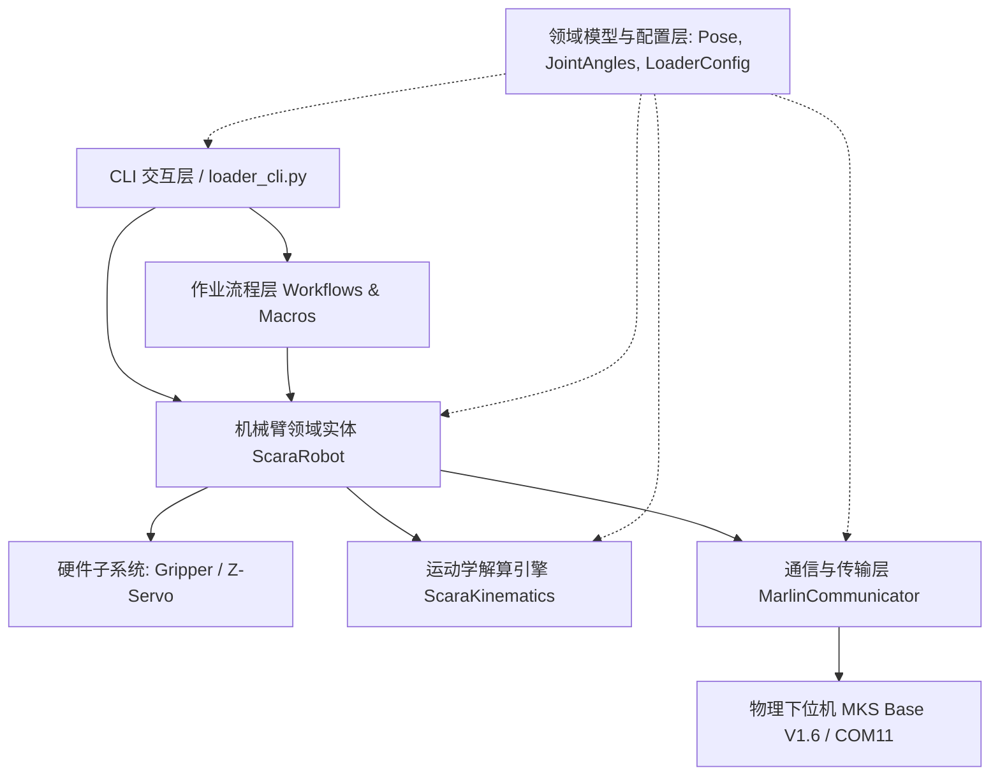

# Flux Loader (SCARA) 调试工具面向对象 (OOP) 架构重构方案

## 1. 重构背景与现状剖析

### 1.1 现状分析
当前 [loader_cli.py](file:///d:/Software/antigravity/flux_loader_mks_v16/tools/loader_cli.py) 为单一脚本文件（800+ 行），虽然实现了完整功能，但存在以下面向对象设计缺陷：
1. **职责高度耦合 (God Objects)**：
   * `MarlinSerialClient` 既承担底层串口读写与超时处理，又承担坐标协议文本解析（`M114` 正则）、运动学关节状态估算、以及设备启动宏发送（`G92`, `M302`）。
   * `LoaderController` 既直接构造底层 G-code 字符串，又控制末端舵机角度映射，还硬编码包含了具体的抓取业务逻辑（`run_pick_and_place_macro`）。
   * `LoaderCLI` 混合了用户控制台菜单打印、输入循环、坐标计算中转、预设点列表增删改查。
2. **缺乏领域数据抽象**：
   * 坐标与角度均采用松散的原始字典（如 `{"X": 0.0, "Y": 600.0, ...}`），缺乏强类型的位姿对象 (`Pose`)、关节角对象 (`JointAngles`) 和限位状态对象 (`LimitSwitchStatus`)。
3. **扩展性受限**：
   * 未来若要接入自动视觉抓取主程序（如 `flux_sorter` 视觉调度），无法直接将机械臂控制能力以 Python SDK 形式导入，强依赖 CLI 菜单。
4. **硬编码参数分散**：
   * 臂长、限位、引脚、舵机角度范围散落在常量或逻辑代码中，不利于后续工程化配置与单元测试。

### 1.2 重构核心目标
* **SOLID 原则全面落地**：
  * **单一职责 (SRP)**：通信只管发收；数学引擎只管几何解算；机械臂实体只管关节与运动控制；工作流管作业流程；CLI 管交互呈现。
  * **开闭原则 (OCP)**：末端工具、工作流宏和交互方式可插件化扩展，无需修改底层机械臂核心逻辑。
  * **依赖倒置 (DIP)**：机械臂核心依赖抽象通信接口，支持真实物理串口 (`SerialTransceiver`) 与仿真模拟设备 (`MockTransceiver`)。
* **分层清晰的模块化架构**：提供可独立调用的核心库 (`loader_core`) 与轻量化入口 (`loader_cli.py`)。
* **100% 行为与功能无回归 (Zero Regression)**：所有已实现的按键映射（包括新加的 W/S/A/D、U/J、Q/E、O/L、I/K 关节微调）完全保持一致。

---

## 2. 目标分层架构设计 (Architecture Layers)

重构后的系统分为 **6 大核心逻辑层**：



### 分层职能说明：
1. **配置与领域模型层 (`config.py` & `models.py`)**：
   * `Pose`：笛卡尔空间位姿值对象（X, Y, Z, R, Feedrate）；
   * `JointAngles`：关节空间角度值对象（Theta 大臂角, Psi 小臂折叠角）；
   * `LimitSwitchStatus`：限位开关状态强类型模型；
   * `LoaderConfig`：集中式硬件配置数据类（臂长、行程、减速比、舵机映射、通信波特率）。
2. **运动学数学引擎 (`kinematics.py`)**：
   * `ScaraKinematics`：纯数学计算类，无任何硬件和串口依赖，输入关节角输出笛卡尔坐标（FK），输入笛卡尔坐标输出关节角（IK），严格支持左右手姿态配置 (`SCARA_ELBOW_DIR`) 与奇异点/可达域校验。
3. **通信与协议传输层 (`comm.py`)**：
   * `ITransceiver` (抽象接口)：定义 `send()`, `readline()`, `connect()`, `disconnect()`。
   * `SerialTransceiver`：基于 `pyserial` 的健壮物理通信实现，包含 DTR 复位等待、自动重试、输入输出缓冲清空。
   * `MarlinProtocolHandler`：Marlin 协议解析器，处理 `ok` 握手判定、`M114` 坐标与 `SCARA Theta/Psi` 文本提取、`M119` 限位状态提取。
4. **机械臂整机与子系统层 (`robot.py` & `subsystems.py`)**：
   * `EndEffector` / `GripperSubsystem`：管理 Z 轴舵机 (Servo 0) 及双夹爪舵机 (Servo 1/2)，维护当前开闭角度及毫米高度转换。
   * `ScaraRobot`：核心聚合根 (Aggregate Root)，组装 Communicator、Kinematics 与 EndEffector，提供高层级工业机器人控制指令：`home()`, `move_cartesian()`, `move_joint()`, `jog()`, `set_z()`, `emergency_stop()`。
5. **作业流程宏层 (`workflows.py`)**：
   * `PickAndPlaceWorkflow`：将抓取、提升、搬运、释放的时序逻辑抽离为独立作业类，支持步骤回调、单步执行、异常安全中止。
6. **交互表现层 (`cli.py` / `menu.py`)**：
   * `JogController`：负责笛卡尔与关节角点动的步长调节与按键调度。
   * `PresetManager`：特征点位（机械零位、待机位、抓取位、下料位）持久化与动态增删。
   * `LoaderCLIApp`：终端菜单渲染、ANSI 格式化、统一异常捕获与命令行参数解析。

---

## 3. 详细类设计与接口定义

### 3.1 领域模型与配置 (`models.py`, `config.py`)

```python
from dataclasses import dataclass, field
from typing import Optional, Dict

@dataclass(frozen=True)
class Pose:
    """笛卡尔空间绝对位姿 (不可变值对象)"""
    x: float
    y: float
    z: float
    r: float = 0.0
    f: Optional[float] = None

    def with_offset(self, dx: float = 0.0, dy: float = 0.0, dz: float = 0.0, dr: float = 0.0) -> 'Pose':
        return Pose(x=self.x + dx, y=self.y + dy, z=self.z + dz, r=self.r + dr, f=self.f)

@dataclass(frozen=True)
class JointAngles:
    """关节空间角度 (度)"""
    theta: float  # 大臂与+X轴夹角
    psi: float    # 小臂相对大臂折叠偏角

@dataclass
class LoaderConfig:
    """机械臂与电气集中配置"""
    # 几何参数 (mm)
    l1: float = 300.0
    l2: float = 300.0
    elbow_dir: int = -1  # -1: 左手, 1: 右手
    
    # 机械零位
    home_pose: Pose = field(default_factory=lambda: Pose(x=0.0, y=600.0, z=80.0, r=0.0))
    home_angles: JointAngles = field(default_factory=lambda: JointAngles(theta=90.0, psi=0.0))
    
    # 运动约束
    default_feedrate: float = 3000.0
    z_min_mm: float = 0.0
    z_max_mm: float = 100.0
    z_servo_max_angle: float = 270.0
    
    # 舵机通道
    z_servo_id: int = 0
    gripper1_id: int = 1
    gripper2_id: int = 2
    gripper_open_angle: int = 0
    gripper_close_angle: int = 90
    
    # 串口参数
    default_baudrate: int = 115200
    timeout: float = 1.0
```

### 3.2 纯数学运动学引擎 (`kinematics.py`)

```python
class ScaraKinematics:
    """SCARA 平面二连杆正逆运动学解算器"""
    def __init__(self, l1: float = 300.0, l2: float = 300.0, elbow_dir: int = -1):
        self.l1 = l1
        self.l2 = l2
        self.elbow_dir = elbow_dir

    def forward(self, angles: JointAngles) -> Tuple[float, float]:
        """正运动学：输入 (Theta, Psi) -> 输出 (X, Y)"""
        a = math.radians(angles.theta)
        b = math.radians(angles.theta + angles.psi)
        x = self.l1 * math.cos(a) + self.l2 * math.cos(b)
        y = self.l1 * math.sin(a) + self.l2 * math.sin(b)
        return x, y

    def inverse(self, x: float, y: float) -> JointAngles:
        """逆运动学：输入 (X, Y) -> 输出 (Theta, Psi)，带可达域与奇异点检查"""
        hypot2 = x * x + y * y
        min_reach = abs(self.l1 - self.l2)
        max_reach = self.l1 + self.l2
        reach = math.sqrt(hypot2)
        if reach > max_reach or reach < min_reach:
            raise ValueError(f"目标坐标 ({x:.1f}, {y:.1f}) 超出可达工作空间 [ {min_reach} ~ {max_reach} mm ]")

        cos_psi = (hypot2 - (self.l1**2 + self.l2**2)) / (2.0 * self.l1 * self.l2)
        cos_psi = max(-1.0, min(1.0, cos_psi))
        psi = math.acos(cos_psi) * self.elbow_dir
        k1 = self.l1 + self.l2 * cos_psi
        k2 = self.l2 * math.sin(psi)
        theta = math.atan2(k1 * y - k2 * x, k1 * x + k2 * y)
        return JointAngles(theta=math.degrees(theta), psi=math.degrees(psi))
```

### 3.3 通信与协议解析器 (`comm.py`)

```python
class ITransceiver(ABC):
    @abstractmethod
    def connect(self, port: str, baudrate: int) -> bool: pass
    @abstractmethod
    def disconnect(self) -> None: pass
    @abstractmethod
    def is_connected(self) -> bool: pass
    @abstractmethod
    def send_and_wait(self, cmd: str, timeout: float = 10.0) -> List[str]: pass

class MarlinProtocolParser:
    """Marlin 回显文本解析器"""
    @staticmethod
    def parse_m114(lines: List[str]) -> Tuple[Optional[Pose], Optional[JointAngles]]:
        # 解析 X:.. Y:.. Z:.. E:.. 以及 SCARA Theta:.. Psi+Theta:..
        ...

    @staticmethod
    def parse_m119(lines: List[str]) -> Dict[str, str]:
        # 解析各限位开关触发状态
        ...
```

### 3.4 机械臂聚合根与执行器子系统 (`robot.py`, `subsystems.py`)

```python
class GripperSubsystem:
    """夹爪与升降执行器子系统"""
    def __init__(self, comm: ITransceiver, config: LoaderConfig):
        self.comm = comm
        self.config = config

    def set_z_height(self, z_mm: float) -> None: ...
    def set_gripper_state(self, gripper_id: int, open_state: bool) -> None: ...

class ScaraRobot:
    """机械臂核心领域实体"""
    def __init__(self, comm: ITransceiver, config: LoaderConfig, kinematics: ScaraKinematics):
        self.comm = comm
        self.config = config
        self.kinematics = kinematics
        self.gripper = GripperSubsystem(comm, config)
        self.current_pose = config.home_pose
        self.current_angles = config.home_angles

    def initialize_home_reference(self) -> None:
        """复位后执行基准同步 G92 与允许冷挤出 M302 P1"""
        ...

    def home(self) -> bool:
        """执行 G28 三轴回原点"""
        ...

    def move_to_pose(self, pose: Pose) -> bool:
        """笛卡尔空间移动 (发 G1 X Y Z E F)"""
        ...

    def move_to_angles(self, angles: JointAngles, feedrate: Optional[float] = None) -> bool:
        """关节空间移动 (正解解算后驱动)"""
        ...

    def jog_cartesian(self, axis: str, delta: float) -> None:
        """笛卡尔单轴点动"""
        ...

    def jog_joint(self, joint: str, delta_deg: float) -> None:
        """关节点动"""
        ...
        
    def disable_steppers(self) -> None:
        """释放使能 M84"""
        ...
```

### 3.5 交互层与点动控制器 (`cli.py`, `jog.py`)

```python
class JogController:
    """点动步长与键位调度器"""
    def __init__(self, robot: ScaraRobot):
        self.robot = robot
        self.step_linear_mm = 10.0
        self.step_rot_deg = 5.0

    def handle_key(self, key: str) -> bool:
        # 分发 W/S (Y轴), A/D (X轴), U/J (Z轴), Q/E (R轴)
        # 分发 O/L (大臂Theta), I/K (小臂Psi)
        # 分发 1/2/3 步长切换
        ...

class LoaderCLIApp:
    """CLI 终端呈现与菜单控制器"""
    def __init__(self, port: Optional[str] = None):
        self.config = LoaderConfig()
        self.kinematics = ScaraKinematics(self.config.l1, self.config.l2, self.config.elbow_dir)
        self.comm = SerialTransceiver()
        self.robot = ScaraRobot(self.comm, self.config, self.kinematics)
        self.jog = JogController(self.robot)
        self.workflow = PickAndPlaceWorkflow(self.robot)
```

---

## 4. 文件组织与模块划分设计

为兼顾优雅的模块化设计与老用户习惯，采用如下文件组织结构：

```
d:\Software\antigravity\flux_loader_mks_v16\
├── loader_core/                   # [新增] 核心面向对象架构包
│   ├── __init__.py                # 导出主要 API
│   ├── config.py                  # LoaderConfig 配置类与默认常量
│   ├── models.py                  # Pose, JointAngles, LimitSwitch 等数据模型
│   ├── kinematics.py              # ScaraKinematics 纯数学正逆解
│   ├── comm.py                    # ITransceiver, SerialTransceiver, MarlinProtocolParser
│   ├── subsystems.py              # GripperSubsystem, ZServoController
│   ├── robot.py                   # ScaraRobot 聚合根实体
│   ├── workflows.py               # PickAndPlaceWorkflow 抓取流程编排
│   └── jog.py                     # JogController 点动微调调度
└── tools/
    └── loader_cli.py              # [重构] 瘦终端入口包装器 (导入 loader_core 并运行 CLIApp)
```

**设计亮点**：
* 外部视觉算法或自动化脚本未来只需 `from loader_core import ScaraRobot, LoaderConfig` 即可直接操控硬件，彻底摆脱控制台交互依赖；
* `tools/loader_cli.py` 保留不变的命令行调用方式（`python tools/loader_cli.py -p COM11`），无缝兼容现有工作流。

---

## 5. 迁移与无回归验证计划 (Verification Plan)

### 5.1 自动化测试
1. **运动学数学单元测试**：
   * 编写 `tests/test_kinematics.py`，验证机械零点、奇异点、极值点在 $FK$ 与 $IK$ 下的双向可逆性（闭环误差 $< 10^{-4}$ mm）。
2. **G-code 协议格式化单元测试**：
   * 验证 `move_to_pose` 生成的字符串严格包含 `E` 而非 `R`，验证 `M302 P1` 与 `G92` 指令时序。
3. **语法与静态类型检查**：
   * 运行 `python -m py_compile` 检查所有新模块。

### 5.2 硬件联机集成验证（COM11）
1. **串口连接握手**：
   * 验证 `python tools/loader_cli.py -p COM11` 正常连入，初始化日志清晰输出坐标与关节角。
2. **点动控制闭环验证**：
   * 笛卡尔微调：测试 W/S/A/D/U/J/Q/E，验证 R 轴步进电机正常旋转，Z 轴舵机正常升降。
   * 关节微调：测试 O/L（大臂）、I/K（小臂），验证提示文字与实际转动。
3. **特征点跳转与搬运宏验证**：
   * 触发 `[6]` 预设点跳转与 `[8]` 芦笋单次搬运节拍宏，验证时序完整性。

---

## 6. 用户确认项与后续动作

> [!IMPORTANT]
> 当前阶段严格**不修改任何源代码**。请审阅上述实施计划，重点确认：
> 1. 包结构设计（提取 `loader_core/` 模块包 + 瘦化 `tools/loader_cli.py`）是否符合您的重构预期？
> 2. 数据结构设计（`Pose`, `JointAngles`, `ScaraRobot`）与方法划分是否满足后续集成需求？

待您回复批准此方案后，我们将立即按照计划开展代码重构工作。
